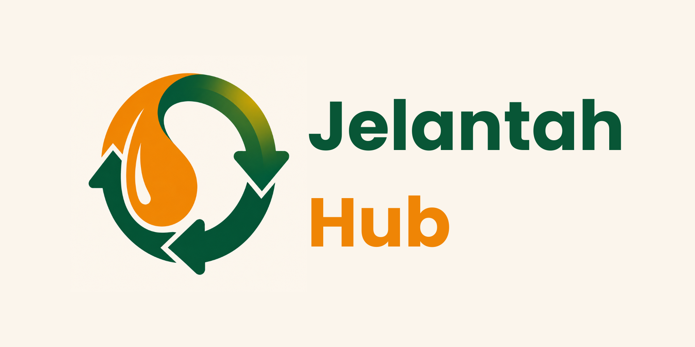

<div align="center">
  
</div>

### **Jelantahmu, rupiahmu.**

Platform eco-fintech sirkular yang mengubah minyak goreng bekas (jelantah)
menjadi biofuel — dan poin yang bisa dicairkan ke saldo digital.

[](https://jelantah-hub.vercel.app)
[](https://jelantah-hub.vercel.app)
[](LICENSE)

[**🌐 Buka Aplikasi**](https://jelantah-hub.vercel.app) ·
[**🚀 Lihat Fitur**](#-fitur-utama) ·
[**🛠 Tech Stack**](#-tech-stack) ·
[**⚡ Setup Lokal**](#-setup-lokal)

</div>

---

## 🌍 Masalah yang Kami Selesaikan

Setiap tahun, ribuan ton minyak jelantah dibuang sembarangan ke saluran air rumah tangga
di Indonesia — mencemari sumber air, menyumbat pipa kota, dan kehilangan potensi ekonomi
yang besar. Padahal jelantah dapat diolah menjadi **biofuel** yang menggantikan solar.

**JelantahHub** menyederhanakan rantai dari dapur warga ke kilang biofuel:
> Setor jelantah → Daur ulang → Cair ke saldo digital
> *(GoPay · DANA · OVO)*

---

## ✨ Fitur Utama

<table>
<tr>
<td width="50%">

### 🪙 Poin & Pencairan
Setiap **5 L jelantah = Rp 25.000** + 12 kg CO₂ dihindari.
Cairkan poin ke GoPay, DANA, atau OVO dengan minimum 200 Pts.

</td>
<td width="50%">

### 🗺️ Jaringan Titik Setor
Cari **bank sampah, warung mitra, dan pos kumpul RT** terdekat.
Filter berdasarkan jenis. Map preview real-time.

</td>
</tr>
<tr>
<td width="50%">

### 📊 Dashboard Real-time
Pantau saldo poin, riwayat setoran, total liter terkumpul, dan dampak
karbon yang dihindari — sinkron langsung dari Firestore.

</td>
<td width="50%">

### 📱 QR Member
Tampilkan QR scannable saat setor di mitra. Verifikasi otomatis
memasukkan poin ke akunmu — tanpa input manual.

</td>
</tr>
<tr>
<td width="50%">

### 🧮 Kalkulator Dampak Interaktif
Slider real-time di hero — geser untuk melihat estimasi
saldo masuk + karbon dihindari per bulan.

</td>
<td width="50%">

### 🤝 Program Mitra
Bank sampah, warung, dan RT/RW dapat mendaftar jadi titik setor:
komisi per liter + alat pengukur volume gratis.

</td>
</tr>
</table>

---

## 🎨 Brand Identity

<table>
<tr>
<td>

| Token | Hex | Pemakaian |
|---|---|---|
| `forest-700` | `#0E3B2E` | Primary CTA, heading, identity |
| `amber-500` | `#D97706` | Accent, conversion, highlight |
| `cream-100` | `#FBF6E9` | Page background |
| `border` | `#E8DEC4` | All borders & dividers |

</td>
<td>

**Typography:** Poppins (400/500/600/700/800)
**Logo:** Drop minyak + 3 panah daur ulang
**Tagline:** Jelantahmu, rupiahmu.

</td>
</tr>
</table>

---

## 🛠 Tech Stack

<div align="center">


-0055FF?style=flat-square&logo=framer&logoColor=white)


</div>

| Layer | Library | Catatan |
|---|---|---|
| Framework | React 19 + TypeScript (strict) | State-based routing, no React Router |
| Build | Vite | HMR + fast cold start |
| Styling | Tailwind CSS v4 (`@theme` directive) | Design tokens di `src/index.css` |
| Animation | `motion/react` (Framer Motion) | Page transitions, stagger, scroll triggers |
| Auth | Firebase Authentication | Google OAuth + Phone (coming soon) |
| Database | Cloud Firestore | onSnapshot real-time + security rules |
| Icons | `lucide-react` | Tree-shakeable SVG icons |
| QR Code | `react-qr-code` | Pure SVG, brand-tinted |
| Deploy | Vercel | Auto-deploy from `main` branch |

---

## 🏗 Arsitektur

```
┌──────────────────────────────────────────────────────────┐
│                    React 19 SPA (Vite)                   │
│ ┌─────────────┐  ┌──────────────┐  ┌──────────────┐      │
│ │   Landing   │→ │   Auth Page  │→ │  Dashboard   │      │
│ │  (Public)   │  │ (Firebase)   │  │ (Authenticated)     │
│ └─────────────┘  └──────────────┘  └──────────────┘      │
└──────────────────────────────────────────────────────────┘
                          ↓ ↑
              ┌───────────────────────┐
              │   Firebase Backend    │
              ├───────────────────────┤
              │  • Auth (Google OAuth)│
              │  • Firestore (rules)  │
              │    ├─ users/          │
              │    ├─ users/{uid}/    │
              │    │   transactions/  │
              │    └─ nodes/          │
              └───────────────────────┘
```

**Routing strategy:** State-based di `src/App.tsx` — tanpa React Router untuk minimize
bundle size + simplicity. Auth state menentukan render: `<LandingPage>` →
`<AuthPage>` → `<Dashboard>`.

**Data sync:** Firestore `onSnapshot` di `AuthContext` (userData) dan `useFirebaseLogic`
(transactions) → semua perubahan real-time, tidak perlu manual refresh.

---

## ⚡ Setup Lokal

### Prasyarat
- **Node.js** ≥ 18
- **npm** (bawaan Node.js)
- **Firebase Project** dengan Authentication + Firestore aktif

### Langkah-langkah

```bash
# 1. Clone repository
git clone https://github.com/arvamadax/JelantahHub.git
cd JelantahHub

# 2. Install dependencies
npm install

# 3. Salin template env, lalu isi credentials Firebase
cp .env.example .env
# (Edit .env: VITE_FIREBASE_API_KEY=..., VITE_FIREBASE_PROJECT_ID=..., dll)

# 4. Jalankan dev server
npm run dev
# → http://localhost:5173
```

### Build production

```bash
npm run build      # Output ke dist/
npm run preview    # Preview build secara lokal
```

### Deploy Firestore Rules

```bash
# Pastikan firebase-cli terinstall global
npm install -g firebase-tools

firebase login
firebase deploy --only firestore:rules
```

---

## 📁 Struktur Proyek

```
JelantahHub/
├── public/
│   ├── logos/                    # Logo brand + mitra (KLHK, Pertamina, IYREF)
│   ├── og-image.jpg              # Social share preview
│   ├── favicon.png               # Browser tab icon
│   └── manifest.json             # PWA manifest
├── src/
│   ├── App.tsx                   # State-based routing
│   ├── index.css                 # Design tokens (Tailwind @theme)
│   ├── main.tsx                  # Entry point + ErrorBoundary
│   ├── components/
│   │   ├── LandingPage.tsx       # Marketing page (semua section)
│   │   ├── AuthPage.tsx          # Google OAuth + error handling
│   │   ├── Dashboard.tsx         # Wrapper dashboard + tabs
│   │   ├── TopBar.tsx            # Header + notifikasi + profile menu
│   │   ├── BottomNav.tsx         # Mobile bottom nav + FAB
│   │   ├── ActivityItem.tsx      # Item transaksi di Riwayat
│   │   ├── NearbyNodeCard.tsx    # Card titik kumpul terdekat
│   │   ├── MapPreview.tsx        # SVG map preview (shared)
│   │   ├── AvatarFallback.tsx    # Photo / initials avatar (shared)
│   │   ├── dashboard/
│   │   │   ├── RiwayatPage.tsx           # Riwayat dengan filter dinamis
│   │   │   ├── TitikKumpulPage.tsx       # List titik setor + search
│   │   │   ├── SetorConfirmModal.tsx     # Modal konfirmasi setor
│   │   │   ├── TukarRewardModal.tsx      # Modal pilih reward
│   │   │   └── QRModal.tsx               # Modal QR member
│   │   └── landing/
│   │       └── HeroCalculator.tsx        # Slider interaktif hero
│   ├── contexts/
│   │   └── AuthContext.tsx       # Firebase Auth + userData live sync
│   ├── hooks/
│   │   ├── useFirebaseLogic.ts   # Transactions + setor/tukar
│   │   └── useNodes.ts           # Firestore nodes subscription
│   └── services/
│       └── firebase.ts           # Firebase init + error handling
├── docs/
│   ├── firebase-blueprint.json   # Firestore schema documentation
│   └── metadata.json             # App metadata
├── firestore.rules               # Production security rules
├── index.html                    # SPA entry + SEO/OG meta
├── vite.config.ts
├── tailwind.config.js (none — using v4 @theme)
└── package.json
```

---

## 🔐 Security

- **Firestore rules:** default-deny + owner-only access untuk users/transactions.
  Transactions immutable (no update/delete).
- **Schema validation di rules:** semua field di-validate type + size + enum.
- **No hardcoded secrets:** Firebase config via `import.meta.env.VITE_*`.
- **Authorized domains:** dikonfigurasi di Firebase Console (Authentication settings).

Detail di [`firestore.rules`](firestore.rules).

---

## 📸 User Flow

```
Landing Page (public)
     │
     ├─→ Hero + Calculator interaktif
     ├─→ Cara Kerja (Kumpulkan → Setor → Cairkan)
     ├─→ Mitra (Bank Sampah / Warung / RT-RW)
     ├─→ Map preview titik setor
     ├─→ Potensi dampak pilot (target proyek)
     ├─→ Personas (siapa pengguna utama)
     └─→ CTA "Daftar Gratis"
            │
            ▼
       Auth Page (Google OAuth)
            │
            ▼
   ┌────────────────────────────┐
   │    Dashboard (4 tabs)       │
   ├────────────────────────────┤
   │ 🏠 Beranda  → Saldo + Setor │
   │ 🗺️ Map Node → Titik kumpul  │
   │ 📋 Riwayat  → Transaksi     │
   │ 👤 Profil   → QR + Settings │
   └────────────────────────────┘
```

---

## 🤝 Mitra

JelantahHub dirancang untuk berkolaborasi dengan:

<div align="center">

| 🏛️ Pemerintah | ⛽ Energi | 🌱 Komunitas |
|---|---|---|
| Kementerian Lingkungan Hidup & Kehutanan (KLHK) | Pertamina NRE | IYREF 2026 |

</div>

---

## 📄 License

[MIT License](LICENSE) — bebas digunakan untuk learning, modifikasi, dan referensi.

---

<div align="center">

**Dibangun dengan ❤️ untuk lingkungan Indonesia.**

[🌐 jelantah-hub.vercel.app](https://jelantah-hub.vercel.app)

</div>
